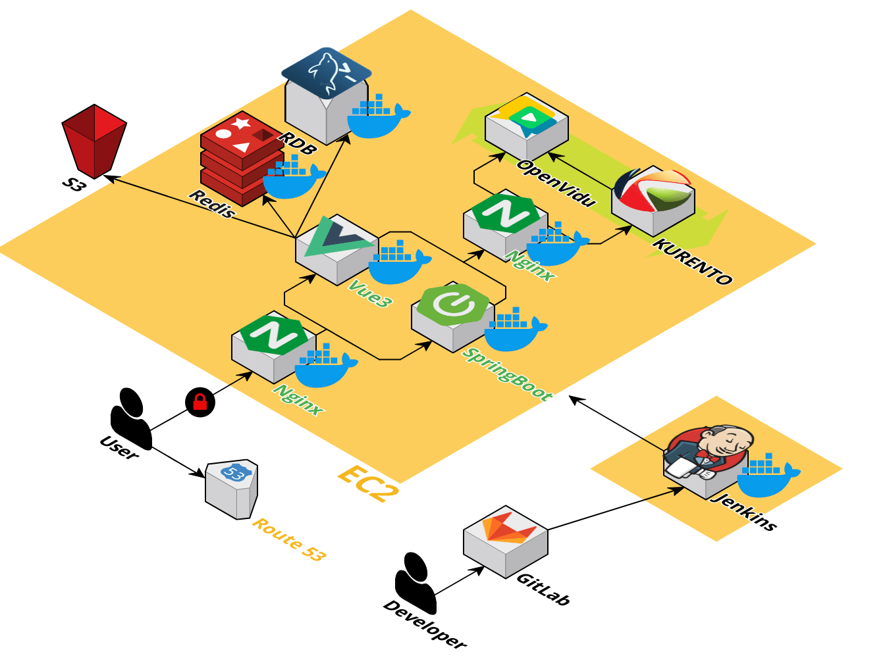
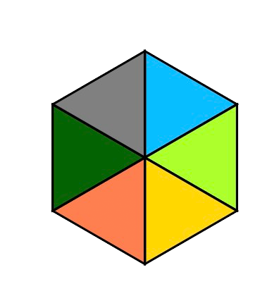
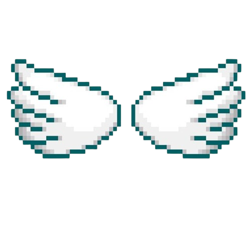
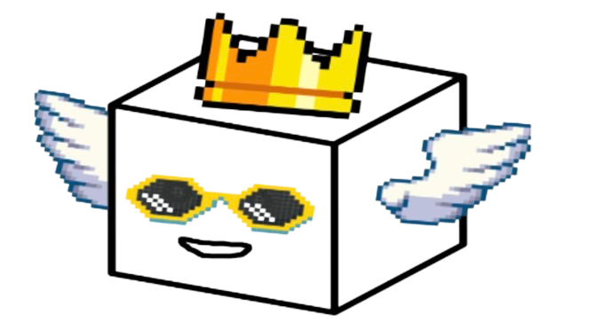
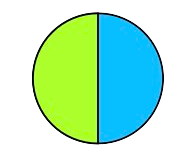
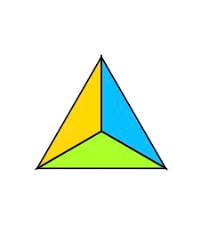
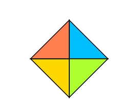
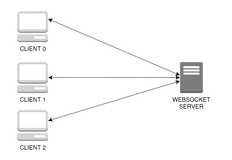

---
<b>기획 배경</b>

혼자 공부하는데 의지가 꺾이는 사람들을 위해서, 같은 목표를 가진 사람들을 소개하고 함께 체계적인 공부환경을 제공할 수 없을까?

<b>목표</b>

- 같은 과목을 공부하는 사람들을 신속하게 매칭시켜줄 수 있다
- 공부 스케쥴의 시스템적인 관리를 통해 공부 능률을 올려줄 수 있다

 

---

<b>기술스택</b>

- Front-End:  
- Back-End:  
- Database:  
 

---
 

    

 

---
 

  
    
    
    
    
    

- 체계적인 공부환경 : 오늘의 공부 스케쥴(이하 다각)에 따라서 자동으로 공부시간 관리/스터디룸 관리를 해줍니다.
- 맞춤형 스터디룸 : 나와 같은 목표를 가진 사람들을 매칭해줍니다.
- 신속한 공부환경 : 시작과 동시에 랜덤 매칭으로 즉시 스터디룸에 입장시켜줍니다.
- 함께하는 모꼬지 : 모임에 가입하고 함께 공부할 수 있습니다.
- 맞춤형 아바타 : 공부시간에 따른 포인트 지급으로 자신의 아바타를 꾸밀 수 있습니다.

 
---
 

1. Recapcha

구글API를 이용한 브루트포스 / 매크로 방지

  
    

2. 다각 생성 로직

공부 과목 갯수와 일정에 따른 다각형 모양

  
    
    
    
    

3. 실시간 상호작용

사용자와 서버와의 웹소켓 통신과,구독/발행을 통해 실시간 상호작용 시스템

  
    

 
---

1. 회원가입 / 로그인 실패

2. OAuth

3. 스터디룸 

4. 친구 / 모꼬지

5. 상점

6. 게시판

